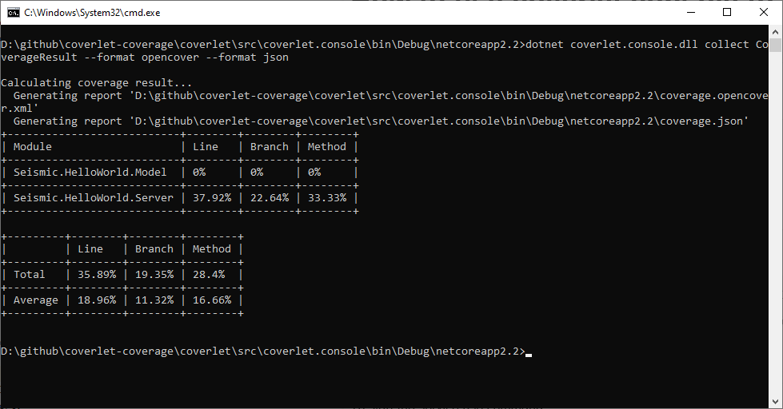
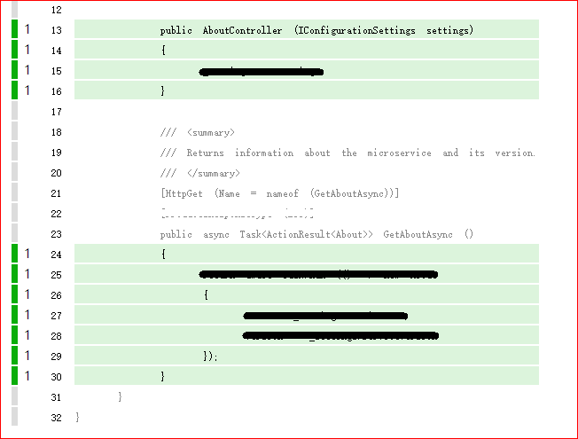
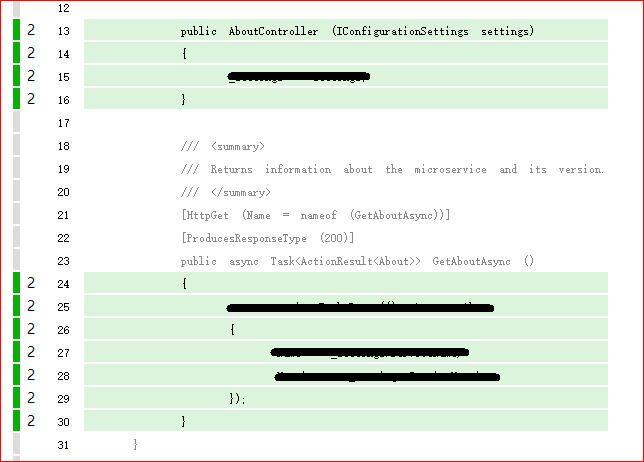

# How to use coverlet.console to get coverage of HelloWorld service locally

## Get HelloWorld service code
Get code from https://github.com/seismic/hello-world and build with vs2019.  
Follow the instructions on that repository to build and run.

## Injection
To inject code for Server.  
```batch
dotnet coverlet.console.dll inject "bin\Debug\netcoreapp2.2\Seismic.HelloWorld.Server.dll" --include-test-assemly
```

## Manually Trigger Server Code
To start the service use command:  
```batch
dotnet Seismic.HelloWorld.Server.dll
```
And open http://localhost  
Trigger the About api 

## Collect the manual coverage result
Run the command to get result  
```batch
dotnet coverlet.console collect CoverageResult --format opencover --format json
```  

The _--format json_ is for merging results, because the coverlet.console only support json result merging.  
Then run ReportGenerator to see the report.
```batch
reportgenerator -reports:.\coverage.opencover.xml -targetdir:Report -reporttypes:Html
```
_Report/Seismic.HelloWorld.Server_AboutController.html_


## Run UT to Trigger Server Code and Collect the UT result
Goto folder \test\Seismic.HelloWorld.Server.Tests\bin\Debug\netcoreapp2.2
We have two way to do this.
* inject coverage code again to get new coverage result.  
    Thus we have two separated results. One is result from manual the other is from UT.  
    And we can merge the two report into one.
* copy the injected dll to overwrite the dll in the test folder.  
    Thus the UT's operation will append to the original result.  

The 2nd way is quit simple and the operation is same with the manual. So we only talk about the first way.  
We can see the test dll **Seismic.HelloWorld.Server.Tests.dll**, server dll **Seismic.HelloWorld.Server.dll** and model dll **Seismic.HelloWorld.Model.dll**
So before run ut, we need to inject coverage code to server and model dll.  
```batch
dotnet coverlet.console.dll inject "bin\Debug\netcoreapp2.2\Seismic.HelloWorld.Server.Tests.dll"
```
Since we need to merge the new coverage result with the previous one, it's important to backup the **coverage.json**  
Here we backup to **old data\coverage.json**  
With all things done run the UT  
```batch
dotnet test Seismic.HelloWorld.Server.Tests.dll
```

And then run reportgenerator to get report. We can also see the **GetAboutAsync** is trigger once by UT  
_Report/Seismic.HelloWorld.Server_AboutController.html_


Now we can merge the Manual and UT's coverage result into one.  
```batch
dotnet coverlet.console collect CoverageResult --format opencover --format json --merge-with ".\old data\coverage.json"
```

And get report  
_Report/Seismic.HelloWorld.Server_AboutController.html_

We can see the method is trigger twice. One is manual and the other is UT. 